# BRMS Rules

This repository functions as a version management tool for the SDPR Business Rules Engine (BRE) and Business Rules Engine Management System (BRMS) Rules.

## Table of Contents

1. [How to Contribute](#how-to-contribute)
2. [How to Add a New File](#how-to-add-a-new-file)
3. [How to Tag Someone for Review](#how-to-tag-someone-for-review)
4. [How to Tag Someone in a Comment](#how-to-tag-someone-in-a-comment)
5. [How to Review a Contribution](#how-to-review-a-contribution)
6. [License](#license)

## How to Contribute

Please note that this project is released with a [Contributor Code of Conduct](CODE_OF_CONDUCT.md). By participating in this project you agree to abide by its terms.

Thank you for your interest in contributing to our repository! Follow the steps below to get started:

### 1. Sign Up for a GitHub Account

If you don't already have a GitHub account, you must [sign up for one](https://github.com/join).

### 2. Request Team Access

If you are new to GitHub and/or the BC Government, you will be required to join the [bcgov GitHub organization](https://github.com/bcgov). Sign up for access by following this link to the [bcgov GitHub Single Sign-On Link](https://github.com/orgs/bcgov/sso). If this link does not work, the most up-to-date instructions can be found on the [BCDevExchange](https://dev.developer.gov.bc.ca/docs/default/component/bc-developer-guide/use-github-in-bcgov/bc-government-organizations-in-github/#single-sign-on-is-coming-to-the-bc-governments-github-organizations).

After confirming membership in the bcgov organization, request that a team member add you to the ISD-BRE team on GitHub.

If you are already part of the bcgov GitHub organization, you can also [request approval through GitHub directly](https://github.com/orgs/bcgov/teams/isd-bre).

Once approved, you will be able to submit edits.

## How to Add a New File

New or changed rules are managed through the [SDPR Business Rules Management System (BRMS) Application](https://brms-simulator-dev.apps.silver.devops.gov.bc.ca/). The BRMS Rules repository is used to manage the rules that are used in the BRMS Simulator. These instructions are provided in the event that you would like to directly add a new rule to the BRMS Rules repository.

### 1. Select the Dev Working Branch

Use the dropdown to switch to the `dev` branch. New or changed rules must be submitted to this branch for review.

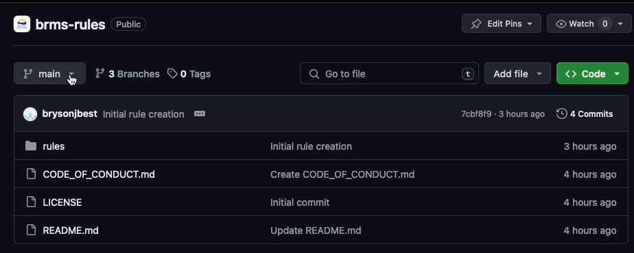

### 2. Navigate to the Desired Folder

Navigate through the repository to the desired folder for the item you wish to modify:

1. Click on the `rules` folder.
2. Select the folder where the rule you would like to modify is currently located, or where would like to create a new rule.
3. Click on the `Add file` button located in the upper right of the screen, and proceed to the next step to upload the desired files.

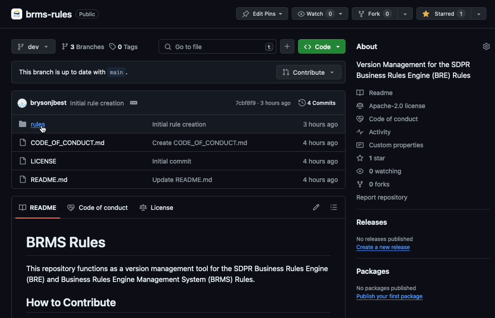

### 3. Upload Your File

Drag the changed or new file into the window, or select it using the file explorer.

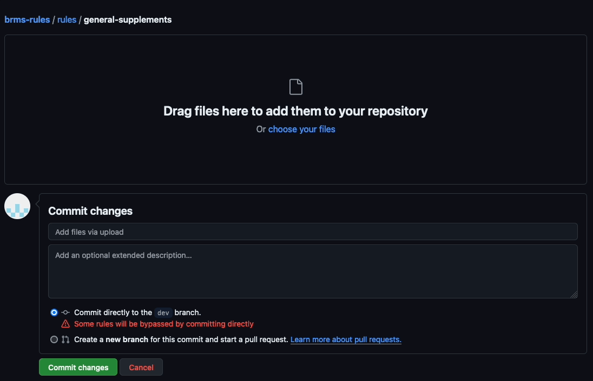

### 4. Add a Commit Message

Add a short summary of the change as the header/title. This line should explain the commit in one line, using the imperative mood (e.g., "Add", "Fix", "Update", "Change", "Remove"), and should be less than 50 characters in length.

#### Examples:

- Add user authentication feature
- Fix typo in monthly benefit rule
- Remove deprecated benefit language

Add an additional extended description detailing the changes you have made.

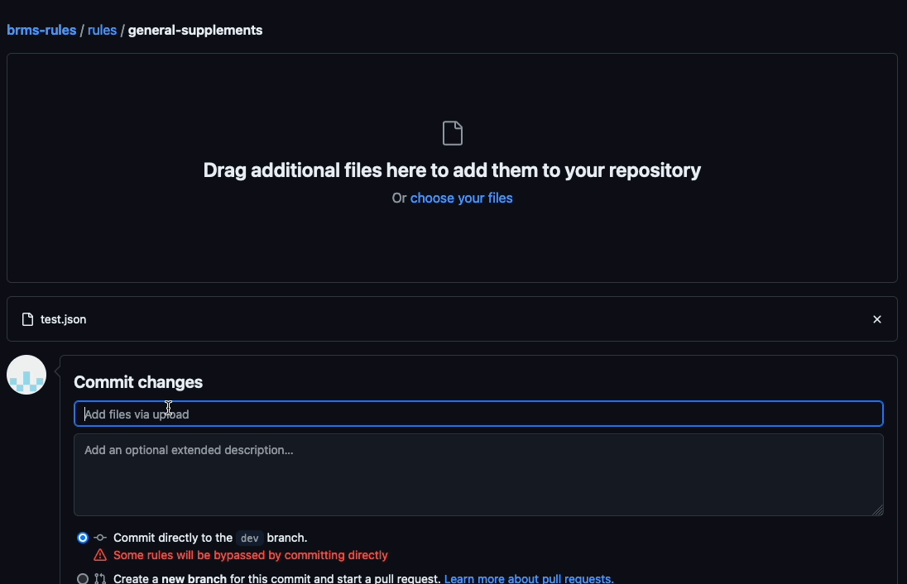

### 5. Create a Pull Request

1. Select `create a new branch for this commit and start a pull request`.
2. Title the pull request with your username, the category of the branch, and the name of the update in the format: `author-category-name`

#### Categories

| Category     | Meaning                                                                 |
| ------------ | ----------------------------------------------------------------------- |
| hotfix       | quick fixes to critical issues                                          |
| bugfix       | bugs fixes                                                              |
| policyupdate | adding, removing, or modifying a rule in alignment with a policy update |
| test         | experimenting with something                                            |
| wip          | a work in progress                                                      |

#### Example:

brysonjbest-policyupdate-test-text-insertion

3. Click the `Propose changes` button.

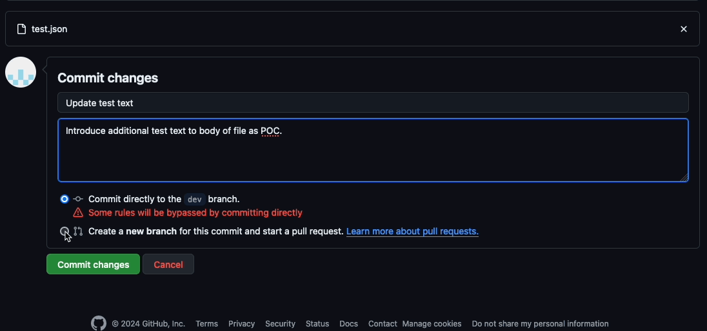

### 6. Submit Pull Request

You will be presented with a final screen that shows the details of your request.

1. Confirm that the base branch selected (your desired working branch) is correct.
2. Confirm the title and description are correct.
3. Click the 'Create pull request' button to submit your request.

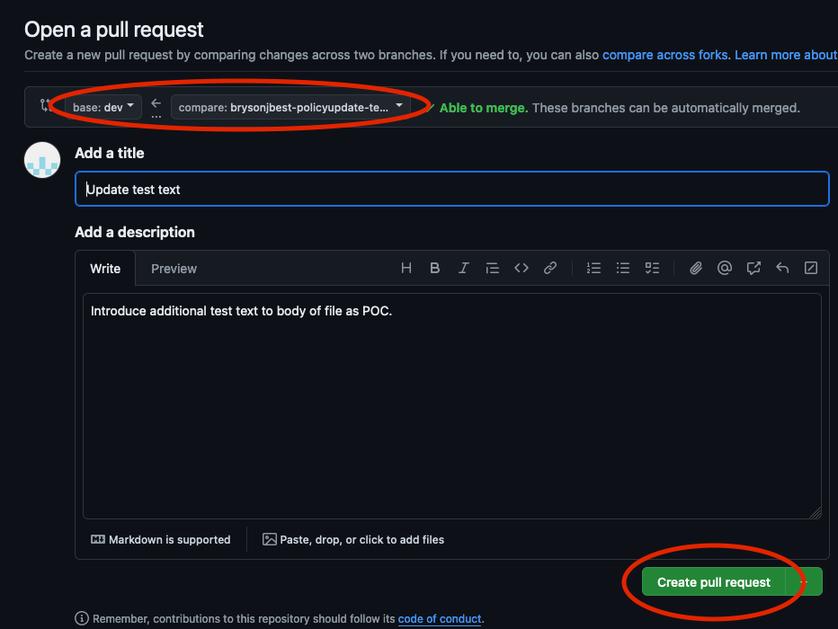

### 7. Notify a Maintainer

After making sure that your change request has been pushed through, send a message to one of the repository maintainers to get it double-checked, and if everything looks good, they will update the repository with your proposed changes.

Thank you for your contributions!

## How to Tag Someone for Review

### 1. Navigate to the Pull Request

Navigate to the pull request you would like to request to be reviewed.

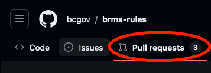

### 2. Tag a Contributor

Click on the `Reviewers` option in the top right corner of the pull request, and search for the contributor you would like to tag.

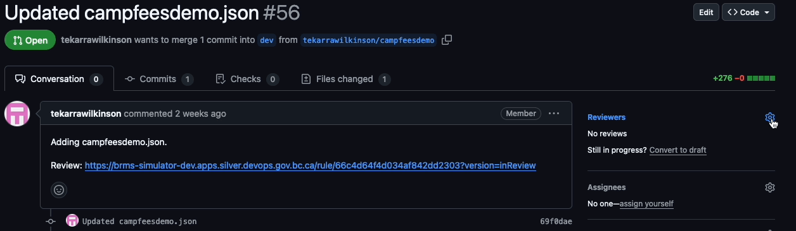

## How to Tag Someone in a Comment

### 1. Navigate to the Pull Request

Navigate to the pull request you would like to comment on.


### 2. Write a Comment

Write a comment in the conversation tab, and tag the contributor you would like to tag by using the `@` symbol.

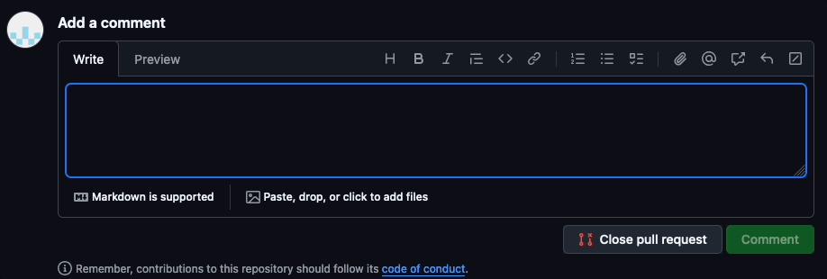

Your comment will be sent to the contributor, and will be added to the conversation tab.

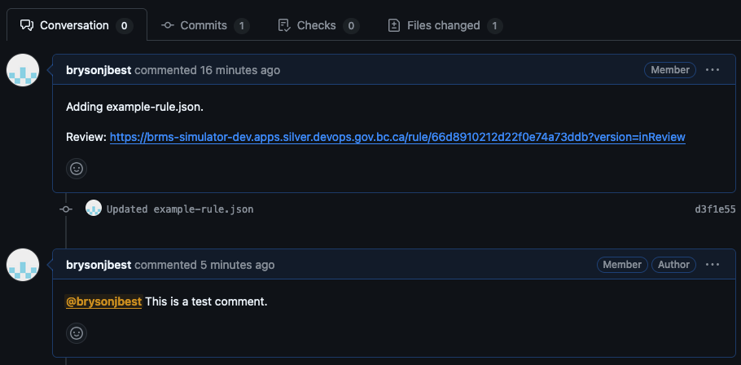

## How to Review a Contribution

When a GitHub user is tagged in a comment, or is added to the reviewers list, they will be notified by email.

If you are requested to review a pull request, follow the steps below to begin your review.

### 1. Navigate to the Pull Request

Navigate to the pull request you would like to tag.


### 2. Begin your Review

Click on the `Review` button in the top right corner of the pull request.

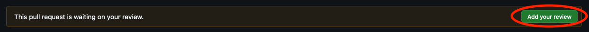

### 3. Click on the link to the BRMS Simulator in the conversation tab

This will take you to the BRMS Simulator, where you can see the changes that have been made to the rule.

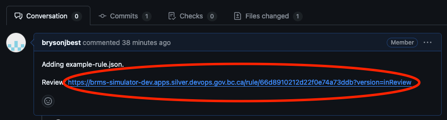

### 4. Review the Changes

Review the changes that have been made to the rule, and take note of any issues or questions that you may have.

### 5. Submit a Review

Provide feedback on the changes that have been made using the `Review Changes` button. Include any questions or issues that you may have. You can tag another contributor with your comment using the `@` symbol.

Once you have reviewed the changes and provided feedback, select the type of feedback you are providing (Comment, Approve, or Request Changes), and click on the `Submit review` button to submit your review.

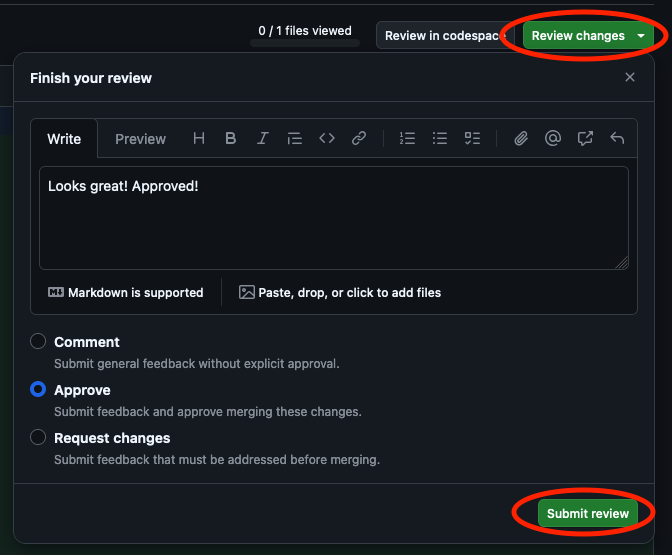

### 7.Notify the next contributor

After submitting your review, tag the next contributor in the chain of custody for the rule. You can do this by clicking on the `Reviewers` option in the top right corner of the pull request, and searching for the next contributor, or by adding a comment in the conversation tab.

## License

```
Copyright 2024 Province of British Columbia

Licensed under the Apache License, Version 2.0 (the "License");
you may not use this file except in compliance with the License.
You may obtain a copy of the License at

    http://www.apache.org/licenses/LICENSE-2.0

Unless required by applicable law or agreed to in writing, software
distributed under the License is distributed on an "AS IS" BASIS,
WITHOUT WARRANTIES OR CONDITIONS OF ANY KIND, either express or implied.
See the License for the specific language governing permissions and
limitations under the License.
```
